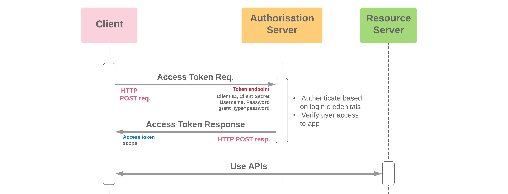
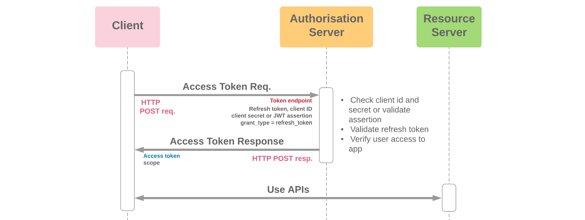
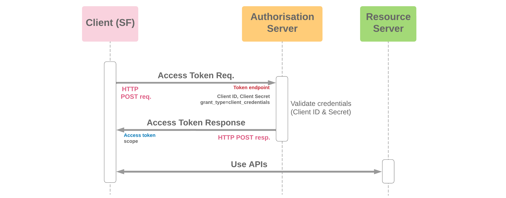

# Authorization Server - AlgaFood API

Este é um **Authorization Server** desenvolvido com **Spring Security OAuth2**, usando **Java 17** e **Spring Boot 2.7.4**. Ele é parte de uma aplicação maior, o projeto **AlgaFood API**, que atua como **Resource Server**. Este projeto tem o objetivo didático de entender o funcionamento da **autenticação** e **autorização** com OAuth2 em um cenário legado, já que o Spring mudou recentemente a abordagem para o gerenciamento de Authorization Servers.

## Objetivo

O projeto tem como principal objetivo:

- Prover um Authorization Server que emite tokens OAuth2 para proteger APIs da AlgaFood.
- Servir como uma referência para **gerenciamento de Authorization Server** em projetos legados que ainda utilizam **Spring Security OAuth2**.
- Auxiliar no entendimento do fluxo de autenticação e autorização com **OAuth2**.
- Facilitar a transição futura para as novas versões do Spring Authorization Server.

## Tecnologias Utilizadas

- **Java 17**
- **Spring Boot 2.7.4**
- **Spring Security OAuth2**
- **JWT (JSON Web Tokens)** para autenticação e autorização
- **Maven** como ferramenta de build

## Estrutura do Projeto

O projeto é composto pelos seguintes módulos:

1. **Authorization Server**: Responsável pela emissão e validação dos tokens.
2. **Resource Server (AlgaFood API)**: Uma API protegida que utiliza os tokens gerados pelo Authorization Server.

## Funcionalidades

- **Autenticação**: Gera tokens de acesso (Access Tokens) baseados no protocolo OAuth2.
- **Autorização**: Protege recursos utilizando escopos e roles associadas ao token.
- **Suporte a múltiplos Grant Types**:
  - Authorization Code
  - Password Credentials (somente para fins de teste)
  - Client Credentials
- **Armazenamento de Tokens**: Armazena os tokens em memória, mas pode ser facilmente configurado para armazenar tokens em um banco de dados externo.

## Fluxo de Autenticação

1. O cliente (ex: uma aplicação frontend) faz uma requisição para o **Authorization Server** solicitando um token de acesso.
2. O **Authorization Server** autentica o cliente e emite um **Access Token**.
3. O cliente utiliza esse **Access Token** para acessar recursos protegidos na **AlgaFood API** (Resource Server).
4. A **AlgaFood API** valida o token e, se for válido, permite o acesso ao recurso solicitado.

## Como Executar o Projeto

### Pré-requisitos

- **Java 17**
- **Maven**

### Passos para execução:

1. Instale as dependências e execute o projeto:

   ```bash
   mvn clean install
   mvn spring-boot:run
   ```
2. A aplicação será iniciada em http://localhost:8081.

## Endpoints Disponíveis

### 1. Password Flow

O **Password Flow** permite que um cliente obtenha um token de acesso usando as credenciais do usuário (login e senha). Este fluxo é ideal para clientes que podem confiar nas credenciais do usuário, como uma aplicação web.

- **Endpoint**: `/oauth/token`
- **Método**: `POST`
- **Parâmetros**:
  - `grant_type`: `password`
  - `username`: O nome de usuário do usuário.
  - `password`: A senha do usuário.
  - `client_id`: O ID do cliente registrado no servidor de autorização.
  - `client_secret`: O segredo do cliente.

#### Exemplo de requisição (Postman):
```bash
POST /oauth/token
Content-Type: application/x-www-form-urlencoded

grant_type=password
username=<seu_username>
password=<sua_senha>
client_id=algafood-web
client_secret=web123
```
#### Resposta:
Um token JWT que pode ser usado para acessar recursos protegidos.

### 2. Refresh Token

O **Refresh Token Flow** permite que o cliente obtenha um novo token de acesso sem a necessidade de re-autenticar o usuário. Esse fluxo é utilizado quando o token de acesso atual expira.

- **Endpoint**: `/oauth/token`
- **Método**: `POST`
- **Parâmetros**:
  - `grant_type`: `refresh_token`
  - `refresh_token`: O refresh token que foi retornado anteriormente.
  - `client_id`: O ID do cliente.
  - `client_secret`: O segredo do cliente.

#### Exemplo de requisição (Postman):
```bash
POST /oauth/token
Content-Type: application/x-www-form-urlencoded

grant_type=refresh_token
refresh_token=<seu_refresh_token>
client_id=algafood-web
client_secret=web123
```

#### Resposta:
Um novo token JWT válido por um período de tempo.

### 3. Client Credentials Flow

O Client Credentials Flow permite que o cliente obtenha um token de acesso usando suas próprias credenciais (sem a necessidade de um usuário final). Esse fluxo é ideal para comunicação entre servidores ou para acesso a APIs que não exigem interação do usuário.

**Endpoint:** `/oauth/token`  
**Método:** `POST`  

#### Parâmetros:
- `grant_type`: client_credentials
- `client_id`: O ID do cliente registrado no servidor de autorização.
- `client_secret`: O segredo do cliente.

#### Exemplo de requisição (Postman):
```bash
POST /oauth/token
Content-Type: application/x-www-form-urlencoded

grant_type=client_credentials
client_id=faturamento
client_secret=faturamento123
```

#### Resposta:
Um token JWT que pode ser usado para acessar recursos protegidos.

### 4. Authorization Code Grant Type


O Authorization Code Grant Type é utilizado para obter um token de acesso através de um código de autorização. Esse fluxo é geralmente usado por aplicações web que podem armazenar um cliente secreto de maneira segura.

#### Passos

1. O usuário é redirecionado para a página de login do servidor de autorização.
2. O usuário se autentica e dá permissão ao cliente.
3. O servidor de autorização redireciona o usuário de volta para a aplicação cliente, com um **código de autorização** na URL.
4. A aplicação cliente troca o código de autorização por um **token de acesso**.

#### 1. Solicitação do Código de Autorização

O primeiro passo é redirecionar o usuário para o servidor de autorização. A URL da solicitação terá a seguinte estrutura:

`GET /oauth/authorize`

**Parâmetros:**
- `response_type`: `code`
- `client_id`: O ID do cliente registrado no servidor de autorização.
- `redirect_uri`: O URI para onde o usuário será redirecionado após a autorização.
- `state`: Um valor opcional para prevenir ataques de falsificação de solicitação entre sites (CSRF).

**Exemplo de URL:**
```
http://localhost:8081/oauth/authorize?response_type=code&client_id=foodanalytics&redirect_uri=http://aplicacao-cliente&state=abc
```

#### 2. Troca do Código de Autorização por um Token de Acesso

Após o usuário autorizar o acesso, ele será redirecionado para o URI especificado com um parâmetro `code`. Agora, o cliente precisa enviar uma solicitação `POST` para trocar o código de autorização por um token de acesso.

**Endpoint:** `/oauth/token`  
**Método:** `POST`

**Parâmetros:**
- `grant_type`: `authorization_code`
- `code`: O código de autorização que foi retornado no redirecionamento.
- `redirect_uri`: O mesmo `redirect_uri` usado na solicitação do código de autorização.
- `client_id`: O ID do cliente.
- `client_secret`: O segredo do cliente.

**Exemplo de requisição (Postman):**
```
POST /oauth/token
Content-Type: application/x-www-form-urlencoded

grant_type=authorization_code
code=<seu_codigo_de_autorizacao>
redirect_uri=[https://seu-app.com/callback](http://aplicacao-cliente)
client_id=foodanalytics
client_secret=food123
```

# Autor
<b>Thallyta Macedo Carvalho de Castro</b>

Linkedin: https://www.linkedin.com/in/thallyta-castro/

Medium: https://medium.com/@thallyta-castro-cv

email: thallytacastro.dev@gmail.com
